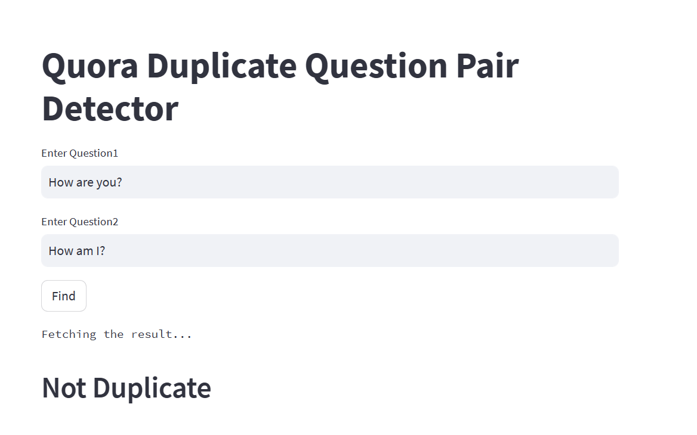

### Introduction
Quora is a popular question and answer platform where users ask questions, and the community provides answers. Over time, similar questions may be posted, resulting in duplicated content. The Quora Duplicate Pair Detection ML Project aims to develop a machine learning model to automatically identify duplicate question pairs on Quora. By accurately detecting duplicate questions, Quora can ensure content quality and improve user experience.

### Objective
The primary objective of this project is to build an efficient machine learning model capable of identifying duplicate question pairs on Quora. The model will be trained on a dataset of labeled question pairs, enabling it to predict if a new question pair is a duplicate or not.

### Dataset
The dataset used for this project consists of question pairs labeled as either duplicates or non-duplicates. The dataset was collected from the Kaggle platform and contains various question pairs, reflecting the diversity of queries users ask. The data has been preprocessed and is ready for use in the machine learning pipeline.

### Methodology
The Quora Duplicate Pair Detection ML Project will follow these steps:

1. Data Preprocessing: The dataset will be cleaned, tokenized, and transformed to make it suitable for machine learning models.
2. Feature Engineering: Relevant features will be extracted from the question pairs, such as  semantic similarity, common words, fuzzy ratios , and textual features.
3. Model Selection: Various machine learning algorithms will be explored and compared.
4. Model Training: The selected model will be trained on the preprocessed dataset using an appropriate training-validation split.

5. Model Evaluation: The model's performance will be evaluated using relevant metrics like accuracy, precision, recall, and F1-score.

6. Hyperparameter Tuning: If necessary, hyperparameter tuning techniques will be applied to improve the model's performance.

7. Testing: The final model will be tested on an unseen dataset to assess its real-world effectiveness.

  

### Conclusion
The Quora Duplicate Pair Detection ML Project aims to enhance content quality on the Quora platform by automatically identifying duplicate question pairs. By successfully developing an efficient machine learning model, Quora can improve user experience and provide more accurate and diverse answers to the community.

